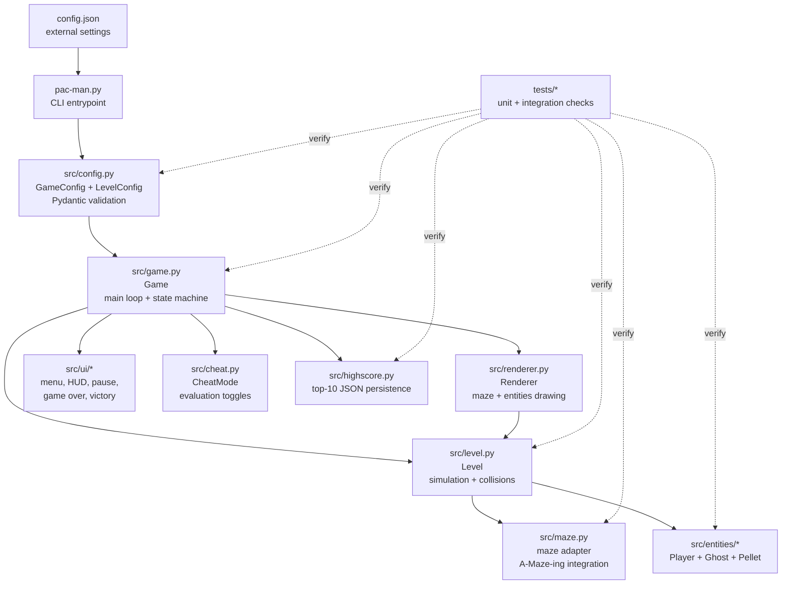
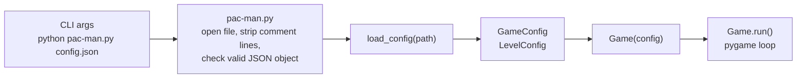
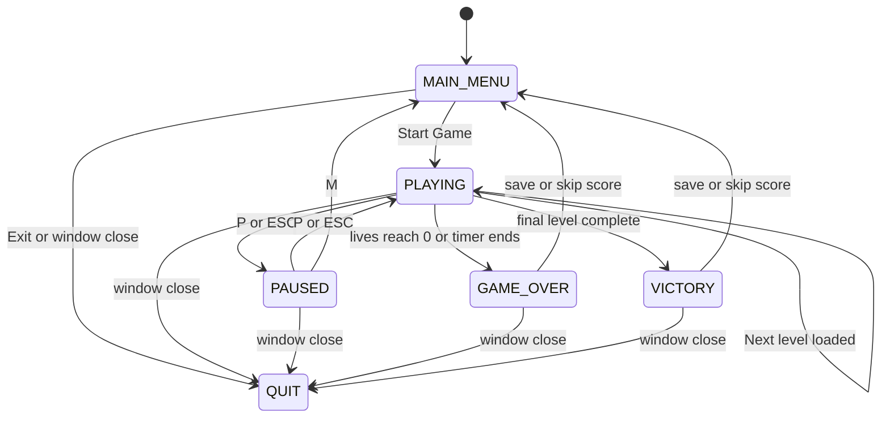
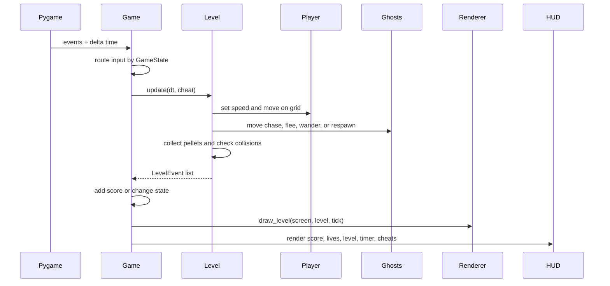
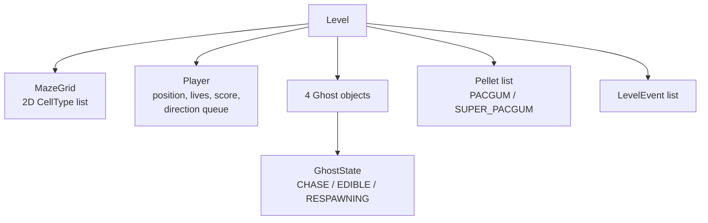
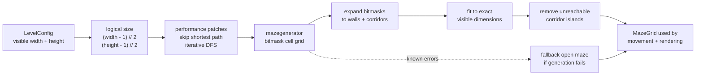
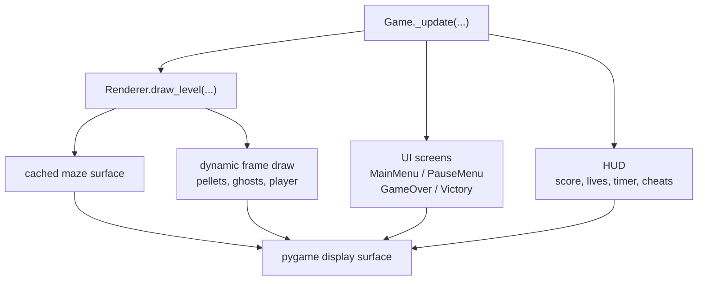
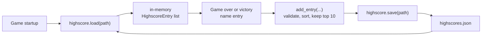

*This project has been created as part of the 42 curriculum by prasingh, msantos2.*

# Pac-Man — Ghosts! More ghosts!

A complete recreation of the classic 1980 arcade game Pac-Man, built in Python with a modular OOP architecture, pygame graphics, and external maze generation.

---

## Description

Navigate Pac-Man through procedurally generated mazes, eating pacgums and avoiding ghosts. Eat a super-pacgum to turn the tables — ghosts become edible for a short time. Clear all pacgums to advance to the next level. The game features a persistent highscore system, a full graphical UI, and a cheat mode for evaluation.

---

## Instructions

### Requirements

- Python 3.10 or later
- [uv](https://docs.astral.sh/uv/) package manager

### Install

```bash
make install
```

This runs `uv sync --all-groups`, creating a `.venv` and installing all runtime and dev dependencies.

### Run

```bash
make run
# or directly:
uv run python pac-man.py config.json
```

The program takes exactly one argument: a path to a JSON configuration file.

### Debug

```bash
make debug
```

Launches the game under Python's built-in `pdb` debugger.

### Lint

```bash
make lint          # flake8 + mypy
```

### Test

```bash
make test
```

### Package

```bash
make package
```

Creates a redistributable source archive in `pkg/` containing the game,
default configuration, in-package instructions, tests, and the assigned
`mazegenerator` wheel.

Deployment is complete: the packaged build is available on itch.io at
[marcokramer.itch.io/pac-man](https://marcokramer.itch.io/pac-man).

### Clean

```bash
make clean
```

Removes `__pycache__`, `.mypy_cache`, `.pytest_cache`, and compiled Python files.

---

## Controls

### In-game

| Key | Action |
|-----|--------|
| Arrow keys / WASD | Move Pac-Man |
| `P` / `ESC` | Pause / unpause |

### Cheat keys (during gameplay)

| Key | Effect |
|-----|--------|
| `I` | Toggle invincibility (ghosts cannot kill you) |
| `F` | Toggle ghost freeze (ghosts stop moving) |
| `B` | Toggle speed boost (faster movement) |
| `L` | Add an extra life |
| `N` | Skip to the next level immediately |

Active cheats are shown in the HUD strip at the bottom of the screen.

### Menus

| Key | Action |
|-----|--------|
| `UP` / `DOWN` | Move main menu selection |
| `ENTER` / `SPACE` | Confirm selected menu item |
| `ESC` | Back / Quit from main menu / Main menu (pause) |
| `M` | Main menu (pause screen) |
| `ENTER` | Confirm name and save score (game over / victory) |

---

## Configuration

The game is configured via a JSON file passed as a command-line argument:

```bash
uv run python pac-man.py config.json
```

The config path is mandatory and must use a `.json` extension (case-insensitive).
If the file cannot be opened, is not valid JSON, or does not contain a JSON
object at the root, the program prints a clear error and exits without a
traceback.

The config file supports `#` and `//` comment lines (stripped before parsing).
Inside a valid JSON object, all keys are optional — missing or invalid values
fall back to safe defaults without crashing.

### Keys

| Key | Default | Description |
|-----|---------|-------------|
| `highscore_filename` | `"highscores.json"` | Path to the highscore storage file |
| `lives` | `3` | Starting lives (clamped to 1–99) |
| `pacgum` | `42` | Parsed compatibility value; pacgums are placed automatically in most reachable corridors |
| `points_per_pacgum` | `10` | Score for eating a pacgum (clamped to 1–99999) |
| `points_per_super_pacgum` | `50` | Score for eating a super-pacgum (clamped to 1–99999) |
| `points_per_ghost` | `200` | Score for eating an edible ghost (clamped to 1–99999) |
| `level_max_time` | `90` | Time limit per level in seconds (clamped to 10–3600) |
| `levels` | 10 default levels | Array of per-level configs (`width`, `height`, and `seed` for level 1) |

Level `width` and `height` are the exact visible maze size in grid cells.
Each dimension is clamped to the supported range of `7` through `100`.
The `seed` in the first level entry generates a reproducible first maze;
seeds in later entries are ignored because subsequent mazes are random.

### Example

```json
{
  # Starting lives
  "lives": 3,
  "points_per_pacgum": 10,
  "points_per_super_pacgum": 50,
  "points_per_ghost": 200,
  "level_max_time": 90,
  "highscore_filename": "highscores.json",
  "levels": [
    { "width": 20, "height": 20, "seed": 42 },
    { "width": 21, "height": 21 }
  ]
}
```

---

## Highscore

Highscores are stored in a JSON file on disk (path set by `highscore_filename` in config, default `highscores.json`).

**Why JSON file storage:** simple, portable, human-readable, and requires no external database dependency — fits the project's self-contained deployment requirement.

**Rules:**
- Top 10 scores are kept, sorted by score descending.
- Player names: max 10 characters, alphanumeric and spaces only.
- Scores: non-negative integers.
- Loaded at game start; saved when a game ends (win or lose).
- Robust to missing or corrupt files — starts fresh without crashing.

---

## Maze Generation

Mazes are generated by an externally assigned *A-Maze-ing* package (not written by us). The package is used as-is via a thin adapter in `src/maze.py`.

- **Level 1** uses `levels[0].seed` (default `42`) for a reproducible first level.
- **Subsequent levels** use random seeds for variety.
- Config `width` and `height` describe the exact visible maze grid; the adapter converts them to the logical size required by A-Maze-ing and fits the result back into the requested dimensions.
- Normal pacgums are placed in reachable corridor cells; super-pacgums are placed at the four ghost corner positions.
- `PERFECT=False` is passed to produce Pac-Man-compatible looping corridors.
- If the generator raises a known exception (`AttributeError`, `IndexError`, `RuntimeError`, `ValueError`), `src/maze.py` falls back to a minimal valid open maze and logs an error — the game continues.


### Performance notes (`mazegenerator-2.0.1`)

Two fixes were applied to address slowness introduced by the library:

**1. Double generation (`src/maze.py`)** — `MazeGenerator.__init__` already calls `generate()` internally. The adapter was calling `mg.generate(seed=seed)` a second time after construction, causing the full maze algorithm — including `_find_short_path()`, an iterative-deepening DFS that scales O(W×H²) — to run twice on every level load. The redundant call was removed.

**2. Per-frame maze redraw (`src/renderer.py`)** — the maze never changes during a level, but `_draw_maze` was issuing thousands of `pygame.draw.rect` calls per frame on larger grids. The renderer now pre-renders the maze to a `pygame.Surface` once on level load and blits that surface each frame instead.

---

## Technical Choices

### Pydantic vs Dataclasses

The project uses both, each where it fits best.

| | `dataclasses` | `pydantic` |
|---|---|---|
| Validation | None built-in | Built-in, rich |
| Type coercion | None | Automatic |
| Error messages | You write them | Detailed, automatic |
| Performance | Faster | Slight overhead per construction |
| Dependency | stdlib | External |
| Serialization | Manual | `.model_dump()` / `.model_validate()` built-in |

**Pydantic** is used for `GameConfig` and `LevelConfig` because config files are untrusted external input — wrong types, missing keys, and out-of-range values are all expected. Pydantic handles this declaratively: `Field(ge=1, le=99)` documents and enforces the valid range in one place, `model_config = {"extra": "ignore"}` silently drops unknown keys, and `model_validate(dict)` parses directly from the JSON dict without manual key unpacking.

**Dataclasses** are used for game entities (`Player`, `Ghost`, `Pellet`) because they are constructed by trusted internal code, never parsed from external input. Pydantic's validation overhead on every object creation inside a game loop would be wasteful.

---

## Implementation

| Phase | Description | Status |
|-------|-------------|--------|
| 1 | Project scaffold — Makefile, stubs, lint pipeline | ✅ |
| 2 | Config loading — Pydantic v2, comment stripping, clamping | ✅ |
| 3 | Maze integration — A-Maze-ing adapter, expanded grid | ✅ |
| 4 | Core entities — Player, Ghost AI, Pellets | ✅ |
| 5 | Level & game loop — update loop, state machine, collision events | ✅ |
| 6 | Renderer & UI — animated sprites, polished screens | ✅ |
| 7 | Highscore system — persistent top-10 JSON storage | ✅ |
| 8 | Cheat mode — all 5 keys wired, HUD display | ✅ |
| 9 | Packaging and deployment — `make package` build distributed online | ✅ |
| 10 | Project management documents | ✅ |

## General Software Architecture

The project is organised around a small state-machine application shell and a
separate gameplay simulation model. `Game` owns the pygame loop, menus,
transitions, scoring, and persistence. `Level` owns the live maze, player,
ghosts, pellets, timer, and collision rules. Rendering is kept separate from
simulation so gameplay can be tested without opening a pygame window.

Read the diagrams from top-level ownership first, then startup flow, runtime
state, gameplay events, rendering, persistence, and tests.

### High-level module map



### Startup and configuration flow

At launch, the entrypoint accepts exactly one argument: the JSON configuration
path. It performs a syntax preflight so command-line errors produce clean
messages, then delegates full validation to `src/config.py`.



Configuration is treated as untrusted input. Missing values use defaults,
unknown keys are ignored, and invalid numeric values are clamped to safe ranges.
The generated `GameConfig` is the single source of truth for lives, scoring,
level dimensions, the first-level seed, timer length, and highscore file path.

### Game state machine

`GameState` in `src/game.py` controls which input handler and renderer are
active at any moment. Only `Game` changes top-level state; lower-level objects
report events instead of directly switching screens.



### Gameplay update flow

The frame loop runs at 60 FPS. During gameplay, keyboard input updates the
player's queued direction or cheat flags. `Level.update()` advances the
simulation and returns `LevelEvent` values. `Game` translates those events into
score changes, level transitions, game over, or victory.



Important event ownership:

| Event | Produced by | Consumed by | Result |
|-------|-------------|-------------|--------|
| `PACGUM_EATEN` | `Level` | `Game` | Add normal pacgum points |
| `SUPER_PACGUM_EATEN` | `Level` | `Game` | Score added by Game; edible state set by Level |
| `GHOST_EATEN` | `Level` | `Game` | Add ghost points |
| `PLAYER_HIT` | `Level` | `Game` | Life was lost; continue if still alive |
| `GAME_OVER` | `Level` | `Game` | Open game-over score entry |
| `LEVEL_COMPLETE` | `Level` | `Game` | Load next level or victory screen |
| `TIMEOUT` | `Level` | `Game` | Open game-over score entry |

### Level, maze, and entity model

`Level` is the owner of all gameplay data for the current stage. It generates
the maze, removes unreachable corridors, places the player, places four ghosts
near reachable corners, and fills reachable corridors with pacgums.



Ghost movement is intentionally simple and grid-based. Ghosts use BFS when they
need a shortest path, flee by choosing the neighbour farthest from the player
while edible, and temporarily disappear in `RESPAWNING` state after being eaten.

### Maze generation pipeline

The assigned `mazegenerator` package is isolated behind `src/maze.py`, so the
rest of the game only depends on the project's own `MazeGrid` format.



The maze grid is shared by movement, collision, pellet placement, and drawing.
`CellType.CORRIDOR` is walkable; `CellType.WALL` and `CellType.BLOCK` are not.

### Rendering and UI

Rendering reads state but does not own game rules. The maze is pre-rendered to a
cached `pygame.Surface` when a level loads, then dynamic objects are drawn each
frame on top of it.



### Persistence and verification

Highscores are stored as a local JSON top-10 list. Loading is fail-safe: missing
or corrupt files produce an empty list instead of crashing. Saving happens only
after game over or victory name entry.



Tests mirror the architecture:

| Area | Test files | What they verify |
|------|------------|------------------|
| Entrypoint/config | `test_entrypoint.py`, `test_config.py` | CLI errors, JSON parsing, comment stripping, validation, defaults |
| Maze | `test_maze.py`, `test_maze_gen.py`, `test_maze_sizes.py` | dimensions, walls, corridors, deterministic seeds, fallback |
| Gameplay model | `test_level.py`, `test_entities.py` | movement, BFS, pellets, timers, collisions, level events |
| App/UI input | `test_game_input.py`, `test_menu.py` | keyboard routing, menu navigation, start/exit behavior |
| Persistence | `test_highscore.py` | JSON load/save, validation, sorting, corrupt-file recovery |

---

## Folder and File Structure

```text
.
├── pac-man.py                         # CLI entrypoint: validates args, loads config, starts Game
├── config.json                        # Default game configuration used by make run
├── pyproject.toml                     # Python version, runtime deps, dev deps, local wheel source
├── Makefile                           # Install, run, debug, lint, test, package, clean commands
├── mazegenerator-2.0.1-py3-none-any.whl
│                                      # Assigned external maze generator dependency
├── README.md                          # Main user, setup, architecture, and project documentation
│
├── src/                               # Runtime game package
│   ├── config.py                      # Pydantic config models and JSON loading
│   ├── game.py                        # Top-level pygame loop and GameState transitions
│   ├── level.py                       # Level setup, entity placement, update loop, collisions
│   ├── maze.py                        # A-Maze-ing adapter and MazeGrid helpers
│   ├── renderer.py                    # Pygame drawing for maze, pellets, ghosts, player
│   ├── highscore.py                   # Persistent top-10 JSON highscore storage
│   ├── cheat.py                       # CheatMode flags and HUD labels
│   ├── entities/                      # Gameplay objects owned by Level
│   │   ├── player.py                  # Pac-Man movement, lives, score
│   │   ├── ghost.py                   # Ghost AI and CHASE/EDIBLE/RESPAWNING states
│   │   └── pellet.py                  # Pacgum and super-pacgum data model
│   └── ui/                            # Screen and overlay renderers
│       ├── menu.py                    # Main menu, highscores view, instructions view
│       ├── hud.py                     # Score, lives, timer, level, active cheats
│       ├── pause.py                   # Pause overlay
│       ├── gameover.py                # Game-over score entry screen
│       └── victory.py                 # Victory score entry screen
│
├── tests/                             # Pytest test suite
│   ├── test_config.py                 # Config parsing, defaults, clamping, errors
│   ├── test_entrypoint.py             # CLI argument and config-file error handling
│   ├── test_entities.py               # Player, Ghost, Pellet behavior
│   ├── test_game_input.py             # Gameplay and menu keyboard routing
│   ├── test_highscore.py              # Highscore load/save/add validation
│   ├── test_level.py                  # Level setup, timer, pellets, collisions, cheats
│   ├── test_maze.py                   # Maze expansion, walls, corridors, fallback
│   ├── test_maze_gen.py               # Assigned generator integration smoke test
│   ├── test_maze_sizes.py             # Maze sizing behavior
│   └── test_menu.py                   # Main menu navigation and actions
│
└── management/                        # Project management and process documents
    ├── team.md                        # Team organization
    ├── technical_choices.md           # Technical rationale
    ├── test_plan.md                   # Acceptance test strategy
    ├── risks.md                       # Risk analysis and mitigations
    └── timeline.md                    # Project timeline
```

---

## Project Management

Project management documents (timeline, risk analysis, progress tracking, team organization, and test plan) are maintained in the [`management/`](management/) directory. They provide a detailed look into our collaborative process and architectural decisions.

---

## Code Quality

This project includes a custom Claude Code slash command for reviewing Python code against the Zen of Python (PEP 20):

```bash
/pep20-compliance
```

The command checks for: readability, explicit intent, unnecessary complexity, deep nesting, silent errors, and naming clarity. It cites specific line references and suggests concrete refactors.

To add the command to another project, copy `.claude/commands/pep20-compliance.md` into that project's `.claude/commands/` directory.

---

## Resources

- [Pac-Man Wikipedia](https://en.wikipedia.org/wiki/Pac-Man) — game history and mechanics reference
- [pygame documentation](https://www.pygame.org/docs/) — graphics and event loop
- [Pydantic v2 documentation](https://docs.pydantic.dev/latest/) — config validation
- [flake8](https://flake8.pycqa.org/) / [mypy](https://mypy.readthedocs.io/) — linting and type checking
- [uv documentation](https://docs.astral.sh/uv/) — dependency and environment management

**AI usage:** Claude Code (claude-sonnet-4-6) was used to assist with: project scaffolding, Pydantic model design for config validation, entity class implementation (Player, Ghost BFS AI, Pellet), game loop and state machine design, pygame renderer with animated sprites, UI screen layout, test case generation, and PEP 20 compliance review and refactoring (BFS memory optimisation, control-flow simplification, dead-code removal, naming clarity). All generated code was reviewed, understood, and validated before inclusion.
